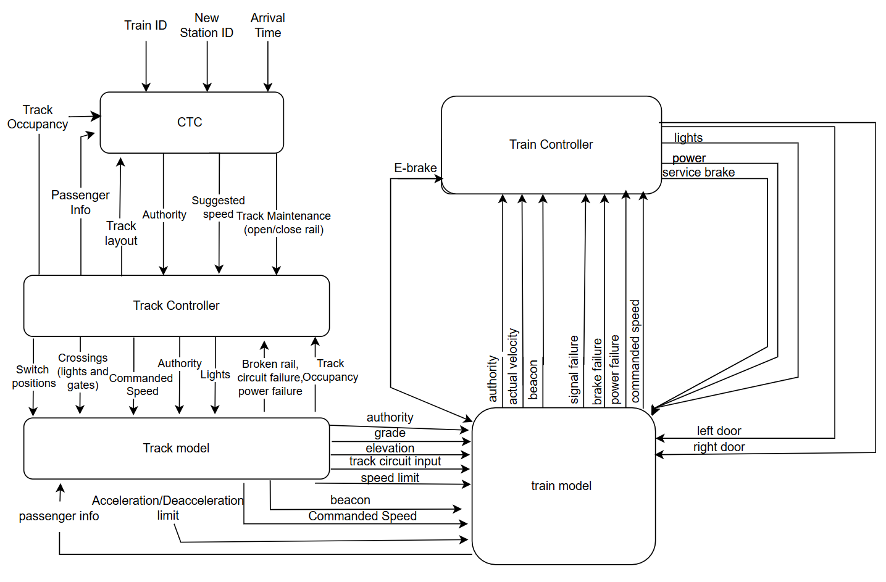

# Python Train Control Simulation

Large-scale train control system simulation built in Python with PyQt5, modeling the interaction between a Centralized Traffic Control system, track model, track controller, train model, train controller, and hardware-facing wayside controller components.

This project simulates a full train network control environment with multiple software modules communicating through shared signal interfaces. It includes train dispatching, route authority, commanded speed calculation, track occupancy, switch and light control, train physics, driver/engineer interfaces, wayside PLC logic, hardware controller code, line data files, unit tests, and a full GUI launcher.

## Demo Video

If you want to see the system running, watch the demo here:

[](https://youtu.be/RWqTWxn2w_w?si=XtGOjOL672tpc4Sr)

[Watch on YouTube](https://youtu.be/RWqTWxn2w_w?si=XtGOjOL672tpc4Sr)

## Overview

This project is a full train system simulation inspired by real railway control architecture. Instead of building only one isolated module, the system is divided into multiple interacting subsystems that represent how a railway network operates.

The application includes:

- Centralized Traffic Control for dispatching and high-level train routing
- Track Model for representing track blocks, line data, stations, occupancy, and failures
- Track Controller Software for wayside logic, traffic lights, switches, crossings, authority, and commanded speed
- Train Model for simulating train physics, movement, passengers, doors, lights, temperature, and advertisements
- Train Controller for automatic/manual train operation and speed/brake control
- Hardware Track Controller components using Arduino/C++ and serial-style integration
- PyQt5 user interfaces for launching, controlling, testing, and visualizing each major subsystem

The result is a multi-module simulation that behaves like an integrated train-control environment rather than a single standalone script.




## Key Features

- Full PyQt5 GUI launcher for selecting and opening system modules
- Centralized Traffic Control interface
- Train dispatching and train information management
- Track model for multiple lines and block-level data
- Support for Blue, Green, and Red line CSV track files
- Track occupancy tracking
- Broken rail, circuit failure, and power failure simulation
- Authority and commanded speed communication between subsystems
- Track controller wayside logic
- PLC-based switch, traffic light, and crossing behavior
- Manual and automatic wayside control modes
- Train model simulation with physics calculations
- Train controller interface with driver and engineer controls
- Train speed, acceleration, braking, doors, lights, passenger count, temperature, and advertisement logic
- Hardware track controller support
- Arduino/C++ wayside controller files
- Unit tests for major modules
- Modular signal classes for communication between subsystems

## Tech Stack

- Python
- PyQt5
- Qt Designer `.ui` files
- CSV track data
- NumPy
- PySerial
- Arduino / C++
- Object-oriented system design
- Event-driven GUI programming
- Unit testing with `unittest`

## System Architecture

The system is organized as a set of interacting modules. Each module represents a different part of a train network.

```text
Centralized Traffic Control
        ↓
Track Controller Software
        ↓
Track Model
        ↓
Train Model
        ↓
Train Controller
```

The modules communicate through shared signal objects stored in the `signals/` package. These signal classes act as the communication layer between subsystems.

## Main Subsystems

### Centralized Traffic Control

The CTC module handles higher-level control of the railway system. It manages train dispatching, routing, train information, suggested speeds, authority, schedules, and system-level control.

Key responsibilities:

- Dispatch trains
- Manage train information
- Send authority and suggested speed
- Track simulation time
- Communicate with track controller and track model
- Provide CTC GUI and test UI

Important files:

```text
train_system/CTC/ctc.py
train_system/CTC/main_ui.py
train_system/CTC/test_ui.py
train_system/CTC/train.py
```

### Track Model

The Track Model represents the physical railway infrastructure. It reads track data from CSV files, tracks block-level properties, manages occupancy and failures, and communicates with the train model and track controller.

Key responsibilities:

- Load track layout data
- Represent track blocks
- Track occupancy
- Simulate failures such as broken rail, power failure, and circuit failure
- Maintain block-level state
- Provide UI for interacting with the track network

Important files:

```text
train_system/track_model/track_model.py
train_system/track_model/track_model_ui.py
train_system/track_model/track_model_test_ui.py
train_system/track_model/file_handler.py
```

### Track Controller Software

The Track Controller Software module acts as the software wayside controller. This was one of the most logic-heavy parts of the project. It receives authority, suggested speed, occupancy, and failure information, then computes outputs such as traffic lights, switch positions, crossings, and commanded speed.

Key responsibilities:

- Compute commanded speed
- Process train authority
- Read track occupancy
- React to broken rail, circuit failure, and power failure
- Manage switch positions
- Manage traffic lights
- Manage railroad crossings
- Support manual override modes
- Load and interpret PLC logic files
- Communicate with CTC and Track Model

Important files:

```text
train_system/TrackControllerSoftware/TrackControllerSoftware.py
train_system/TrackControllerSoftware/UI.py
train_system/TrackControllerSoftware/programmerUI.py
train_system/TrackControllerSoftware/testUI.py
train_system/TrackControllerSoftware/PLC_greenline.txt
train_system/TrackControllerSoftware/PLC_redline.txt
train_system/TrackControllerSoftware/PLC_blueline.txt
```

### Train Model

The Train Model simulates the physical behavior of a train. It models speed, acceleration, braking, mass, power, passenger count, doors, lights, temperature, station announcements, advertisements, and train movement behavior.

Key responsibilities:

- Simulate train physics
- Calculate acceleration and speed changes
- Track passenger count
- Manage train doors and lights
- Handle service brake and emergency brake behavior
- Display advertisements and train UI information
- Communicate with the train controller

Important files:

```text
train_system/train_model/train_model.py
train_system/train_model/train_model_manager.py
train_system/train_model/calculations.py
train_system/train_model/main_ui.py
train_system/train_model/TestUI.py
train_system/train_model/advertisements.py
```

### Train Controller

The Train Controller module controls train behavior based on commanded speed, actual speed, authority, driver inputs, and safety logic. It includes driver and engineer interfaces and supports control behavior for speed, braking, doors, and lights.

Key responsibilities:

- Control train operation
- Compare commanded speed and actual speed
- Manage service brake and emergency brake
- Support manual and automatic behavior
- Provide driver UI and engineer UI
- Interface with the train model

Important files:

```text
train_system/train_controller/train_controller.py
train_system/train_controller/controller.py
train_system/train_controller/backup_controller.py
train_system/train_controller/train_controller_manager.py
train_system/train_controller/driver_ui.py
train_system/train_controller/engineer_ui.py
```

### Track Controller Hardware

The hardware controller portion includes Python UI/control files and Arduino/C++ wayside logic. This part represents the hardware-facing version of the track controller and includes embedded-style components.

Key responsibilities:

- Provide hardware control UI
- Interface with Arduino-style controller code
- Represent wayside block behavior
- Support LCD/button libraries
- Test hardware-facing track controller logic

Important files:

```text
train_system/Track_Controller_Hardware/TrackControllerHW.py
train_system/Track_Controller_Hardware/HWMainUI.py
train_system/Track_Controller_Hardware/HWprogrammerUI.py
train_system/Track_Controller_Hardware/Track_control_2.0/Track_control_2.0.ino
train_system/Track_Controller_Hardware/Wayside/Block.cpp
train_system/Track_Controller_Hardware/Wayside/Wayside.cpp
```

## Communication Layer

The system uses signal classes to pass data between modules. This keeps each subsystem separated while still allowing the full train system to behave as one connected simulation.

Important signal files:

```text
train_system/signals/ctc_signals.py
train_system/signals/track_signals.py
train_system/signals/trackcontroller_signals.py
train_system/signals/train_signals.py
train_system/signals/track_to_train_signals.py
```

These files define the shared data passed between:

- CTC and Track Controller
- Track Controller and Track Model
- Track Model and Train Model
- Train Model and Train Controller

## Project Structure

```text
python-train-control-simulation/
│
├── BlueLine.csv
├── GreenLine.csv
├── RedLine.csv
├── 2red_2green.csv
├── README.md
├── LICENSE
│
└── train_system/
    ├── launch.py
    ├── example_communication.py
    ├── example_train_model.py
    ├── test_ctc_wayside.py
    ├── train_controller_test.py
    │
    ├── CTC/
    │   ├── ctc.py
    │   ├── main_ui.py
    │   ├── test_ui.py
    │   ├── train.py
    │   ├── blueLIne.png
    │   ├── green_red_line.png
    │   └── red_green_line_smaller.png
    │
    ├── TrackControllerSoftware/
    │   ├── TrackControllerSoftware.py
    │   ├── UI.py
    │   ├── programmerUI.py
    │   ├── testUI.py
    │   ├── PLC_blueline.txt
    │   ├── PLC_blueline_default.txt
    │   ├── PLC_greenline.txt
    │   ├── PLC_greenline_inverted.txt
    │   ├── PLC_redline
    │   └── PLC_redline.txt
    │
    ├── Track_Controller_Hardware/
    │   ├── TrackControllerHW.py
    │   ├── HWMainUI.py
    │   ├── HWprogrammerUI.py
    │   ├── TestHWlaunch.py
    │   ├── TestHWlauncher.py
    │   ├── TestLauncher.py
    │   ├── Testui_final.py
    │   │
    │   ├── Track_control_2.0/
    │   │   └── Track_control_2.0.ino
    │   │
    │   ├── Wayside/
    │   │   ├── Block.cpp
    │   │   ├── Block.h
    │   │   ├── Wayside.cpp
    │   │   └── Wayside.h
    │   │
    │   ├── LiquidCrystal_I2C-1.1.2/
    │   └── ezButton/
    │
    ├── signals/
    │   ├── launcher.py
    │   ├── ctc_signals.py
    │   ├── track_signals.py
    │   ├── trackcontroller_signals.py
    │   ├── track_to_train_signals.py
    │   └── train_signals.py
    │
    ├── track_model/
    │   ├── track_model.py
    │   ├── track_model_ui.py
    │   ├── track_model_test_ui.py
    │   ├── file_handler.py
    │   ├── testTrackSignals.py
    │   └── blueLine.png
    │
    ├── train_controller/
    │   ├── train_controller.py
    │   ├── controller.py
    │   ├── backup_controller.py
    │   ├── train_controller_manager.py
    │   ├── driver_ui.py
    │   ├── engineer_ui.py
    │   ├── test_ui.py
    │   └── UI/
    │       ├── DriverUi.ui
    │       ├── EngineerUI.ui
    │       └── TestUi.ui
    │
    ├── train_model/
    │   ├── train_model.py
    │   ├── train_model_manager.py
    │   ├── calculations.py
    │   ├── main_ui.py
    │   ├── TestUI.py
    │   ├── advertisements.py
    │   ├── MainUI.ui
    │   ├── TestUI.ui
    │   └── image assets
    │
    └── tests/
        ├── CTC_unit_test.py
        ├── trackControllerTest.py
        ├── track_model_tests.py
        ├── train_controller_tests.py
        └── train_model_tests.py
```

## Track Controller Software Details

The Track Controller Software is responsible for the wayside control logic. It processes data from the track model and CTC, then decides what signals should be sent back to the rest of the system.

The controller manages:

- Authority
- Suggested speed
- Commanded speed
- Track occupancy
- Broken rail detection
- Circuit failure detection
- Power failure detection
- Switch positions
- Traffic lights
- Railroad crossings
- Manual maintenance switch control
- PLC-based logic

The track controller keeps separate internal state for each line:

```text
Blue Line
Red Line
Green Line
```

It uses arrays and block indices to manage line-specific outputs such as:

```text
traffic lights
yellow lights
red lights
commanded speed
crossings
switch positions
rail status
```

This makes the controller one of the central decision-making modules of the simulation.

## Train System Workflow

A simplified version of the system workflow is:

```text
1. CTC dispatches train and sends authority / suggested speed
2. Track Controller receives train and track information
3. Track Controller computes commanded speed, lights, crossings, and switches
4. Track Model updates block occupancy and track status
5. Train Model simulates train movement and physical behavior
6. Train Controller manages train operation using commanded speed and authority
7. Updated train location and status are sent back through the system
8. GUI modules display and update the current state
```

## Installation

Clone the repository:

```bash
git clone https://github.com/YOUR_USERNAME/python-train-control-simulation.git
cd python-train-control-simulation
```

Create a virtual environment:

```bash
python -m venv venv
```

Activate the virtual environment.

On Windows:

```bash
venv\Scripts\activate
```

On macOS/Linux:

```bash
source venv/bin/activate
```

Install required packages:

```bash
pip install PyQt5 numpy pyserial
```

If you create a `requirements.txt`, it should include:

```text
PyQt5
numpy
pyserial
```

## Running the Application

Run the main launcher from the project root:

```bash
python train_system/launch.py
```

The launcher opens the GUI used to access major system modules.

If imports fail depending on your environment, run the launcher from inside the `train_system/` directory:

```bash
cd train_system
python launch.py
```

## Running Tests

The repository includes unit tests for several modules.

From the project root:

```bash
python -m unittest discover train_system/tests
```

Some tests may depend on local paths, GUI availability, or module-specific setup.

## CSV Track Data

The project includes multiple CSV files containing line and block data:

```text
BlueLine.csv
GreenLine.csv
RedLine.csv
2red_2green.csv
```

These files support the track model and are used to represent railway line structure, block information, and track layout data.

## PLC Files

The Track Controller Software includes PLC-style logic files for different lines and configurations:

```text
PLC_blueline.txt
PLC_blueline_default.txt
PLC_greenline.txt
PLC_greenline_inverted.txt
PLC_redline
PLC_redline.txt
```

These files are used by the track controller/programmer UI to define wayside behavior for traffic lights, switches, and crossings.

## Hardware Components

The project also includes hardware-facing code:

```text
Track_control_2.0.ino
Block.cpp
Block.h
Wayside.cpp
Wayside.h
LiquidCrystal_I2C library
ezButton library
```

These files represent the embedded/hardware side of the track controller and wayside simulation. The hardware portion supports interaction with Arduino-style components and physical controller logic.

## Why This Project Is Significant

This project is large because it is not a single algorithm, model, or interface. It is a multi-subsystem simulation where each part depends on communication with the others.

The system includes:

- GUI programming
- Multi-module software architecture
- Train physics
- Railway signaling
- Wayside control logic
- Track data parsing
- Safety/failure simulation
- Manual and automatic control modes
- Hardware-facing controller code
- Unit testing
- Inter-module communication

It demonstrates the ability to build and reason about a complex software system with many moving parts.

## My Role

I worked as the Track Controller engineer, focusing on the wayside logic and the communication between the track controller, CTC, and track model.

My work included:

- Implementing track controller logic
- Computing commanded speed
- Handling authority and suggested speed
- Managing track occupancy state
- Processing broken rail, circuit failure, and power failure data
- Controlling switch positions, traffic lights, and crossings
- Supporting manual maintenance switch behavior
- Integrating PLC-style logic files
- Connecting track controller outputs to the rest of the train system
- Testing controller behavior across different track states and failure scenarios

## Future Improvements

- Refactor module imports for easier installation and packaging
- Add a `requirements.txt` file
- Add screenshots of each major UI module
- Add a system architecture diagram
- Add more detailed setup instructions for hardware mode
- Improve test coverage for track controller edge cases
- Separate simulation mode and hardware mode more cleanly
- Add logging for inter-module communication
- Add configuration files for line-specific controller settings
- Package the application as a desktop executable

## Project Context

This project was built as a full train control system simulation. It combines software engineering, GUI development, control logic, hardware-facing code, data-driven track modeling, and system integration.

The goal was to simulate how different railway subsystems work together, from high-level train dispatching down to low-level wayside and train-control behavior.